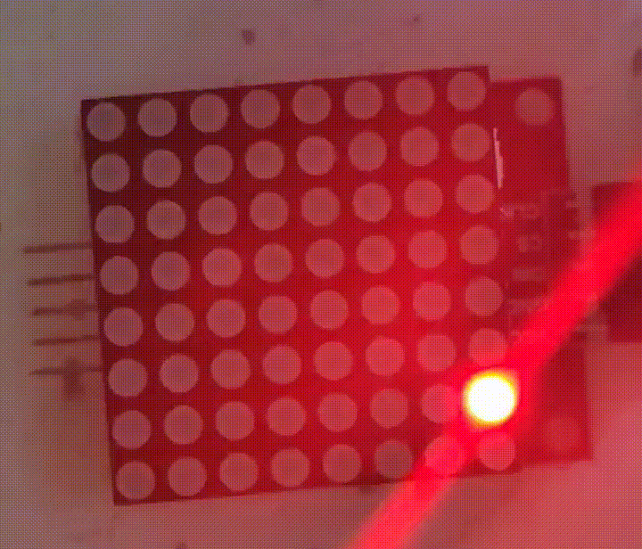
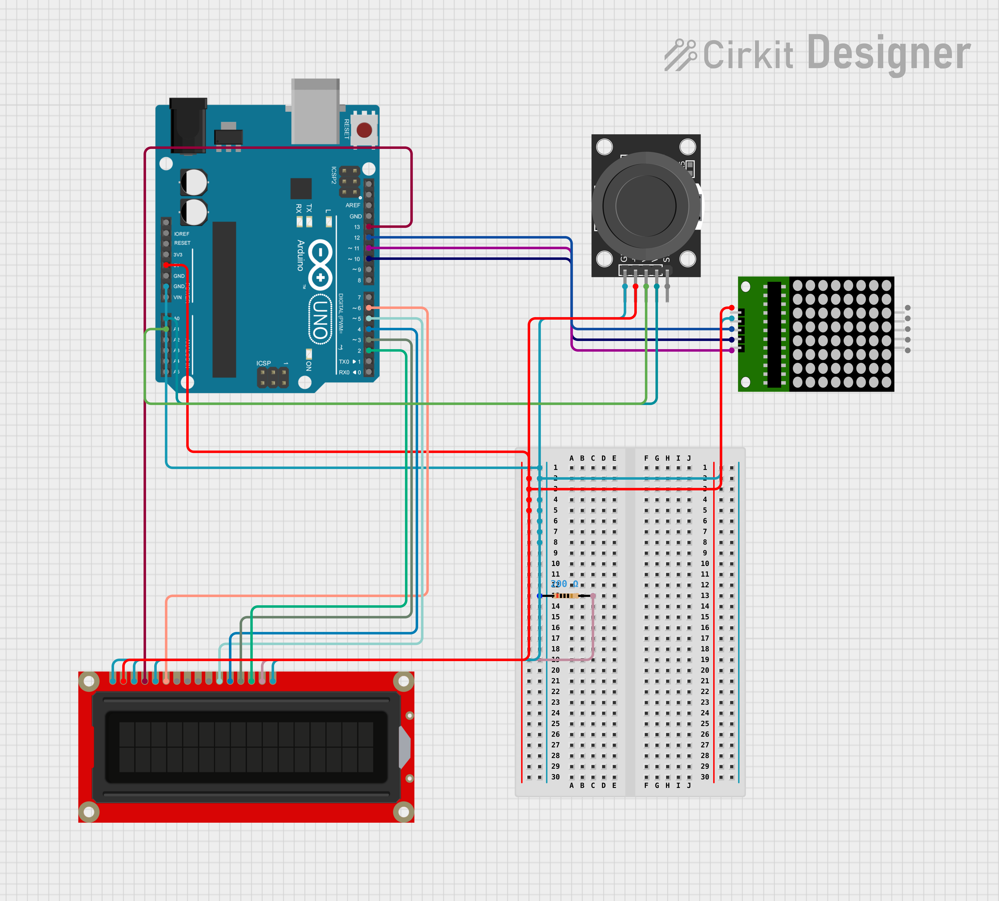

# Arduino Game!
> [!NOTE]
> This is for the Arduino UNO I do not plan to make this compatible for other models but
> it is possible to manually implement it.

what is this project? Well this is the fruits of my free time!
To elaborate, this project uses an LCD, LED matrix, Arduino UNO, and a Joystick to create a sort of playable enviorment.
In a way this is my console! You can use the joystick to move around a red dot character in the LED matrix. I'll be adding
games that function only to this console. 



Currently this project is in very early development and doesn't actually have any games.

# Contents
- [Road Map](#Road-Map)
- [Exporting this project](#Exporting-this-project)
  - [Circuit Diagram](#Circuit-Diagram)
  - [How to build?](#How-to-build) 
#### Road Map
- [x] Playable screen
- [ ] Implementations of special "modules"
- [ ] Apple Catching Game
- [ ] Ghost Hunting

## Exporting this project
### **Circuit Diagram**
---


### **How to build?**
---
> [!IMPORTANT] 
> Must have the following installed:
> - VScode
> - Git
> - PlatformIO (VScode Extension)

Clone this repo into any file
```shell
git clone https://github.com/Nureta/Arduino-Game.git
```
Make sure you have **VScode** installed type
```shell
code Arduino-Game
```
PlatformIO should auto install all dependencies automatically.
Next plug in your arduino UNO and import the project into your microcontroller.
And... Done!!

